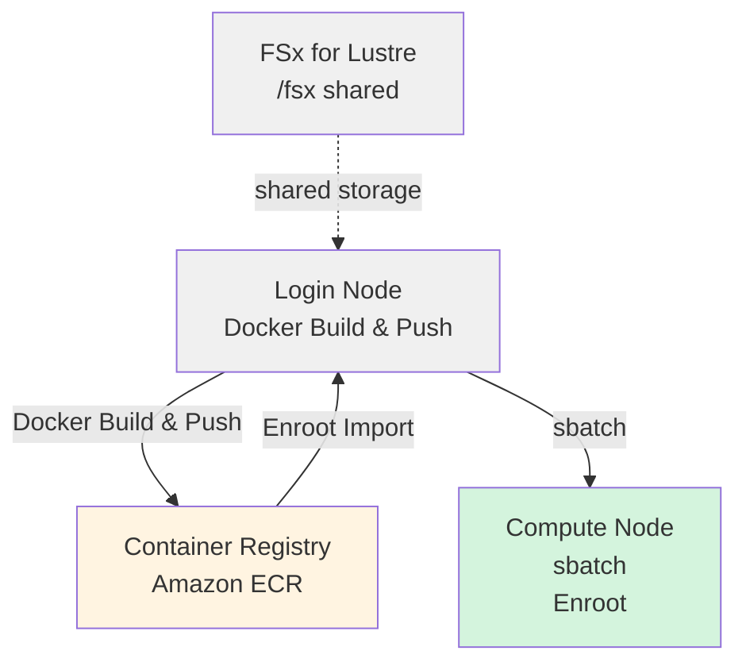

# HyperPod + Slurm + Enroot에서의 NVIDIA Isaac GR00T 트레이닝 실행 가이드

AWS SageMaker HyperPod에서 Slurm + Enroot를 사용하여 Docker 컨테이너로 GR00T 파인튜닝을 실행하는 가이드입니다.

## 아키텍처



---

## 사전 조건

1. **HyperPod 클러스터**: 본 프로젝트 내의 CDK를 사용하여 HyperPod 클러스터를 AWS에 구축한 상태
   - 콘솔 등에서 수동으로 생성한 HyperPod에서도 동일하게 학습을 실행할 수 있습니다
2. **Git LFS**: Isaac GR00T 리포지토리에서는 샘플 데이터 등에 Git LFS를 사용

---

## 실행 절차

### Phase 1: HyperPod Login Node에서의 사전 준비

#### 1.1 HyperPod SSH 접속

```bash
ssh pask-cluster
```

#### 1.2 PASK 리포지토리 clone

```bash
cd
git clone https://github.com/aws-samples/sample-physical-ai-scaffolding-kit.git
```

#### 1.2 Git LFS 설치

[Isaac GR00T](https://github.com/NVIDIA/Isaac-GR00T) 리포지토리에서는 샘플 데이터 등의 큰 파일에 Git LFS를 사용하고 있으므로, [리포지토리를 참고하여 설치](https://github.com/git-lfs/git-lfs/wiki/Installation)합니다.

실행 도중 `Which services should be restarted?`가 표시되면 Tab 키를 눌러 `<Ok>`를 선택하고 Enter로 진행해 주세요.

```bash
curl -s https://packagecloud.io/install/repositories/github/git-lfs/script.deb.sh | sudo bash
sudo apt-get update
sudo apt-get install git-lfs
git lfs install
```

#### 1.3 로그 출력 디렉토리 생성

```bash
mkdir -p /fsx/ubuntu/joblog
```

#### 1.4 Isaac GR00T 리포지토리 Clone

[**Installation Guide**](https://github.com/NVIDIA/Isaac-GR00T/tree/main?tab=readme-ov-file#installation-guide)를 참고하여 리포지토리를 Clone합니다.

```bash
cd
git clone --recurse-submodules https://github.com/NVIDIA/Isaac-GR00T
export GR00T_HOME="$HOME/Isaac-GR00T"
```

---

### Phase 2: Docker 이미지 빌드 & ECR 푸시

#### 2.1 Docker 이미지 빌드 및 ECR Push

Login node에서 Docker 이미지를 빌드하고 ECR에 푸시합니다.

```bash
cd ~/sample-physical-ai-scaffolding-kit/samples/gr00t/training
sbatch slurm_build_docker.sh
```

**환경 정보 확인 방법(HyperPod Cluster)**:

스크립트는 다음 우선순위로 환경 정보를 가져옵니다. HyperPod 내에서 특별히 커맨드라인 인자나 환경 변수 설정 없이 실행한 경우, EC2 인스턴스 메타데이터에서 가져옵니다:

1. **환경 변수** (`AWS_REGION`, `AWS_ACCOUNT_ID`)
2. **자동 감지**
   - **리전**: EC2 인스턴스 메타데이터(IMDSv2)
   - **계정 ID**: AWS STS (`aws sts get-caller-identity`)
3. **폴백**: 리전은 `us-east-1`

**사용 가능한 환경 변수**:

| 변수명 | 기본값 | 설명 |
|--------|-------------|------|
| `GR00T_HOME` | (필수) | Isaac-GR00T 리포지토리 경로 |
| `ECR_REPOSITORY` | `gr00t-train` | ECR 리포지토리 이름 |
| `IMAGE_TAG` | `latest` | Docker 이미지 태그 |
| `AWS_REGION` | 자동 감지 | AWS 리전 |
| `AWS_ACCOUNT_ID` | 자동 감지 | AWS 계정 ID |

```bash
# 예: 리포지토리 이름과 이미지 태그 변경
GR00T_HOME=$HOME/Isaac-GR00T ECR_REPOSITORY=my-gr00t IMAGE_TAG=v1.0.0 \
    sbatch slurm_build_docker.sh
```

**실행 내용**:

- ECR 리포지토리 `gr00t-train` 생성(존재하지 않는 경우)
- Docker 이미지 빌드(Isaac GR00T의 `docker/Dockerfile` 사용)
- ECR로 푸시

**진행 상황 확인**:

```bash
# 작업 상태 확인
squeue

# 작업 ID를 확인하여 변수에 설정
JOBID=<JOB_ID>

# 상세 확인
sacct -j $JOBID

# 실시간 로그 모니터링
tail -f /fsx/ubuntu/joblog/docker_build_$JOBID.out

# 에러 로그 확인
tail -f /fsx/ubuntu/joblog/docker_build_$JOBID.err
```

**출력 예시**:

```bash
==================================================
Docker build and push completed successfully
End Time: Sat Mar 21 01:54:06 UTC 2026
==================================================
```

---

### Phase 3: Enroot 컨테이너 임포트

#### 3.1 Docker 이미지를 SquashFS 형식으로 변환

Docker build로 생성한 이미지를 enroot를 사용하여 변환합니다. 로컬에 Docker 캐시가 있으면 이를 활용하고, 없으면 ECR에서 가져옵니다.

```bash
cd ~/sample-physical-ai-scaffolding-kit/samples/gr00t/training
bash ./hyperpod_import_container.sh
```

완료 후 다음 명령어로 확인할 수 있습니다.

```bash
export ENROOT_DATA_PATH=/fsx/enroot/data
enroot list
```

인자를 지정하는 경우의 예시

```bash
# 이미지 태그 지정
bash ./hyperpod_import_container.sh v1.0.0

# 리전 지정
bash ./hyperpod_import_container.sh latest us-west-2

# 모두 지정
bash ./hyperpod_import_container.sh latest us-west-2 123456789012
```

**환경 정보 확인 방법(HyperPod Cluster)**:

스크립트는 다음 우선순위로 환경 정보를 가져옵니다:

1. **커맨드라인 인자**(최우선)

   ```bash
   ./hyperpod_import_container.sh [IMAGE_TAG] [AWS_REGION] [AWS_ACCOUNT_ID]
   ```

2. **환경 변수**

   ```bash
   export AWS_REGION=us-west-2
   export AWS_ACCOUNT_ID=123456789012
   ./hyperpod_import_container.sh
   ```

3. **자동 감지**
   - **리전**: EC2 인스턴스 메타데이터(IMDSv2)
   - **계정 ID**: AWS STS (`aws sts get-caller-identity`)

4. **폴백**: 리전은 `us-east-1`

**사용 가능한 환경 변수**:

| 변수명 | 기본값 | 설명 |
|--------|-------------|------|
| `IMAGE_TAG` | `latest` | 임포트할 Docker 이미지 태그 |
| `AWS_REGION` | 자동 감지 | AWS 리전 |
| `AWS_ACCOUNT_ID` | 자동 감지 | AWS 계정 ID |
| `ENROOT_CACHE_PATH` | `/fsx/enroot` | Enroot 캐시 디렉토리 |
| `ENROOT_DATA_PATH` | `/fsx/enroot/data` | Enroot 데이터 디렉토리(`.sqsh` 출력 경로) |

**실행 내용**:

- 로컬 Docker 캐시 확인(없으면 ECR에서 Pull)
- SquashFS 형식 (`.sqsh`)으로 변환
- `ENROOT_DATA_PATH`에 저장

---

### Phase 4: Slurm 작업 실행

#### 4.1 파인튜닝 실행

S3에 업로드한 파일을 데이터로 사용하는 경우, 쓰기 작업이 발생하므로 사전에 퍼미션을 변경한 후 트레이닝 명령어를 실행해 주세요.
샘플 데이터가 Lustre의 `/fsx/ubuntu/` 하위에 있는 경우에는 권한 변경이 불필요합니다.

```bash
DATASET_PATH=/fsx/s3link/my_dataset
sudo chmod -R a+w "${DATASET_PATH}"
```

트레이닝 작업은 환경 변수로 파라미터를 커스터마이징할 수 있습니다.

```bash
# 예: GPU 수, 스텝 수, 데이터셋 변경
NUM_GPUS=2 MAX_STEPS=5000 DATASET_PATH=/fsx/ubuntu/my_dataset \
    sbatch slurm_finetune_container.sh
```

**사용 가능한 환경 변수**:

| 변수명 | 기본값 | 설명 |
|--------|-------------|------|
| `NUM_GPUS` | `1` | 사용할 GPU 수 |
| `MAX_STEPS` | `2000` | 최대 트레이닝 스텝 수 |
| `SAVE_STEPS` | `2000` | 체크포인트 저장 간격 |
| `GLOBAL_BATCH_SIZE` | `32` | 글로벌 배치 사이즈 |
| `OUTPUT_DIR` | `/fsx/s3link/so100` | 체크포인트 출력 경로 |
| `DATASET_PATH` | `./demo_data/cube_to_bowl_5` | 트레이닝 데이터셋 경로 |
| `BASE_MODEL` | `nvidia/GR00T-N1.6-3B` | 베이스 모델 |

최소한의 명령어(모두 기본값)

```bash
cd ~/sample-physical-ai-scaffolding-kit/samples/gr00t/training
sbatch slurm_finetune_container.sh
```

**진행 상황 확인**:

```bash
# 작업 상태 확인
squeue

# 작업 ID를 확인하여 변수에 설정
JOBID=<JOB_ID>

# 상세 확인
sacct -j $JOBID

# 실시간 로그 모니터링
tail -f /fsx/ubuntu/joblog/finetune_$JOBID.out

# 에러 로그 확인
tail -f /fsx/ubuntu/joblog/finetune_$JOBID.err
```

---

## Slurm 작업 관리 명령어

### 작업 확인

```bash
# 내 작업 목록
squeue -u ubuntu

# 상세 정보
squeue -u ubuntu -o "%.18i %.9P %.30j %.8u %.2t %.10M %.6D %R"

# 모든 작업(클러스터 전체)
squeue
```

### 작업 취소

```bash
# 특정 작업 취소
scancel <JOB_ID>

# 내 모든 작업 취소
scancel -u ubuntu
```

---

## 참고 리소스

### 문서

- [NVIDIA Isaac GR00T](https://github.com/NVIDIA/Isaac-GR00T) - 공식 리포지토리
- [AWS HyperPod 문서](https://docs.aws.amazon.com/sagemaker/latest/dg/sagemaker-hyperpod.html)
- [Enroot 문서](https://github.com/NVIDIA/enroot)
- [Slurm 문서](https://slurm.schedmd.com/documentation.html)
