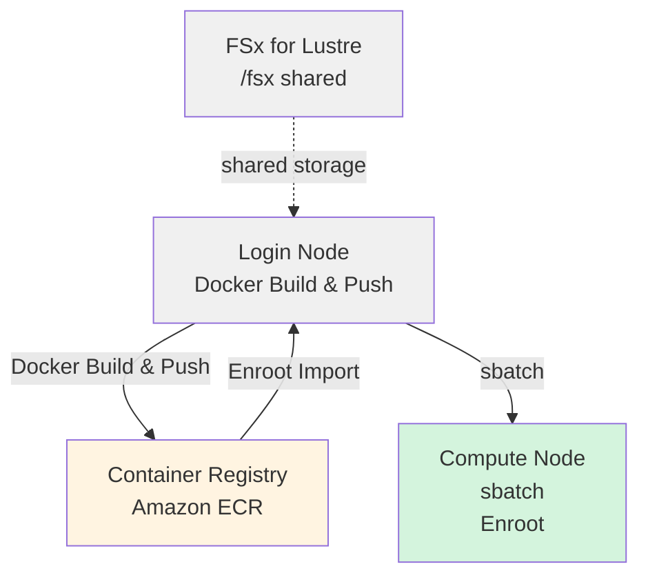

# HyperPod + Slurm + Enroot での NVIDIA Isaac GROOT トレーニング実行ガイド

AWS SageMaker HyperPod 上で Slurm + Enroot を使用して Docker コンテナで GROOT ファインチューニングを実行するガイドです。

## アーキテクチャ



---

## 前提条件

1. **HyperPod クラスタ**: 本プロジェクト内の CDK を使って HyperPod クラスタを AWS 上に構築している
   - コンソールなどから手動で作成した HyperPod でも同様に学習実行は可能です
2. **Git LFS**: Isaac GROOT リポジトリではサンプルデータなどに Git LFS を使用

---

## 実行手順

### Phase 1: HyperPod Login Node での事前準備

#### 1.1 HyperPod への SSH 接続

```bash
ssh pask-cluster
```

#### 1.2 PASK リポジトリのclone

```bash
cd
git clone git@github.com:aws-samples/sample-physical-ai-scaffolding-kit.git
```

#### 1.2 Git LFS のインストール

[Isaac GROOT](https://github.com/NVIDIA/Isaac-GR00T) のリポジトリではサンプルデータなどの大きなファイルは Git LFS を利用しているため、[リポジトリを参考にインストール](https://github.com/git-lfs/git-lfs/wiki/Installation)します。

途中で `Which services should be restarted?` と表示された場合は、Tab キーを押して `<Ok>` を選びエンターで進めてください。

```bash
curl -s https://packagecloud.io/install/repositories/github/git-lfs/script.deb.sh | sudo bash
sudo apt-get update
sudo apt-get install git-lfs
git lfs install
```

#### 1.3 ログ出力先の作成

```bash
mkdir -p /fsx/ubuntu/joblog
```

#### 1.4 Isaac GROOT リポジトリの Clone

[**Installation Guide**](https://github.com/NVIDIA/Isaac-GR00T/tree/main?tab=readme-ov-file#installation-guide) を参考に、リポジトリを Clone します。

```bash
cd
git clone --recurse-submodules https://github.com/NVIDIA/Isaac-GR00T
export GROOT_HOME="$HOME/Isaac-GR00T"
```

---

### Phase 2: Docker イメージのビルド & ECR プッシュ

#### 2.1 Docker イメージのビルドと ECR への Push

Worker node 上で Docker イメージをビルドし、ECR にプッシュします。

```bash
cd ~/sample-physical-ai-scaffolding-kit/samples/groot/training
sbatch slurm_build_docker.sh
```

**環境情報の取得方法（HyperPod Cluster）**:

スクリプトは以下の優先順位で環境情報を取得します。HyperPod 内で特にコマンドライン引数や環境変数設定なしに実行した場合、EC2 インスタンスメタデータから取得します：

1. **環境変数** (`AWS_REGION`, `AWS_ACCOUNT_ID`)
2. **自動検出**
   - **リージョン**: EC2 インスタンスメタデータ（IMDSv2）
   - **アカウントID**: AWS STS (`aws sts get-caller-identity`)
3. **フォールバック**: リージョンは `us-east-1`

**利用可能な環境変数**:

| 変数名 | デフォルト値 | 説明 |
|--------|-------------|------|
| `GROOT_HOME` | （必須） | Isaac-GR00T リポジトリのパス |
| `ECR_REPOSITORY` | `groot-train` | ECR リポジトリ名 |
| `IMAGE_TAG` | `latest` | Docker イメージタグ |
| `AWS_REGION` | 自動検出 | AWS リージョン |
| `AWS_ACCOUNT_ID` | 自動検出 | AWS アカウント ID |

```bash
# 例: リポジトリ名とイメージタグを変更
GROOT_HOME=$HOME/Isaac-GR00T ECR_REPOSITORY=my-groot IMAGE_TAG=v1.0.0 \
    sbatch slurm_build_docker.sh
```

**実行内容**:

- ECR リポジトリ `groot-train` の作成（存在しない場合）
- Docker イメージのビルド（Isaac GROOT の `docker/Dockerfile` を使用）
- ECR へのプッシュ

**進捗確認**:

```bash
# ジョブ状態確認
squeue

# ジョブ ID を確認して変数に設定
JOBID=<JOB_ID>

# 詳細確認
sacct -j $JOBID

# リアルタイムログ監視
tail -f /fsx/ubuntu/joblog/docker_build_$JOBID.out

# エラーログ確認
tail -f /fsx/ubuntu/joblog/docker_build_$JOBID.err
```

**出力例**:

```
Docker image successfully pushed to ECR
Image URI: 123456789012.dkr.ecr.us-east-1.amazonaws.com/groot-train:latest
```

---

### Phase 3: Enroot コンテナのインポート

#### 3.1 Docker イメージを SquashFS 形式に変換

Docker build で作成したイメージを enroot を使って変換します。ローカルに Docker のキャッシュがあればそれを利用し、なければ ECR から取得します。

```bash
cd ~/sample-physical-ai-scaffolding-kit/samples/groot/training

# EC2 メタデータから自動取得
bash ./hyperpod_import_container.sh

# イメージタグを指定
bash ./hyperpod_import_container.sh v1.0.0

# リージョンを指定
bash ./hyperpod_import_container.sh latest us-west-2

# すべて指定
bash ./hyperpod_import_container.sh latest us-west-2 123456789012
```

**環境情報の取得方法（HyperPod Cluster）**:

スクリプトは以下の優先順位で環境情報を取得します：

1. **コマンドライン引数**（最優先）

   ```bash
   ./hyperpod_import_container.sh [IMAGE_TAG] [AWS_REGION] [AWS_ACCOUNT_ID]
   ```

2. **環境変数**

   ```bash
   export AWS_REGION=us-west-2
   export AWS_ACCOUNT_ID=123456789012
   ./hyperpod_import_container.sh
   ```

3. **自動検出**
   - **リージョン**: EC2 インスタンスメタデータ（IMDSv2）
   - **アカウントID**: AWS STS (`aws sts get-caller-identity`)

4. **フォールバック**: リージョンは `us-east-1`

**利用可能な環境変数**:

| 変数名 | デフォルト値 | 説明 |
|--------|-------------|------|
| `IMAGE_TAG` | `latest` | インポートする Docker イメージタグ |
| `AWS_REGION` | 自動検出 | AWS リージョン |
| `AWS_ACCOUNT_ID` | 自動検出 | AWS アカウント ID |
| `ENROOT_CACHE_PATH` | `/fsx/enroot` | Enroot キャッシュディレクトリ |
| `ENROOT_DATA_PATH` | `/fsx/enroot/data` | Enroot データディレクトリ（`.sqsh` 出力先） |

**実行内容**:

- ローカル Docker キャッシュの確認（なければ ECR から Pull）
- SquashFS 形式 (`.sqsh`) に変換
- `ENROOT_DATA_PATH` に保存

---

### Phase 4: Slurm ジョブの実行

#### 4.1 ファインチューニングの実行

S3にアップロードしたファイルをデータとして利用する場合は、書き込みが発生するため事前にパーミッションを変更してから、トレーニングのコマンドを実行してください。

```bash
DATASET_PATH=/fsx/s3link/my_dataset
sudo chmod -R a+w "${DATASET_PATH}"
```

環境変数でパラメータをカスタマイズできます。

```bash
# 例: GPU数、ステップ数、データセットを変更
NUM_GPUS=2 MAX_STEPS=5000 DATASET_PATH=/fsx/ubuntu/my_dataset \
    sbatch slurm_finetune_container.sh
```

**利用可能な環境変数**:

| 変数名 | デフォルト値 | 説明 |
|--------|-------------|------|
| `NUM_GPUS` | `1` | 使用する GPU 数 |
| `MAX_STEPS` | `2000` | 最大トレーニングステップ数 |
| `SAVE_STEPS` | `2000` | チェックポイント保存間隔 |
| `GLOBAL_BATCH_SIZE` | `32` | グローバルバッチサイズ |
| `OUTPUT_DIR` | `/fsx/s3link/so100` | チェックポイント出力先 |
| `DATASET_PATH` | `./demo_data/cube_to_bowl_5` | トレーニングデータセットのパス |
| `BASE_MODEL` | `nvidia/GR00T-N1.6-3B` | ベースモデル |

最低限のコマンド

```bash
cd ~/sample-physical-ai-scaffolding-kit/samples/groot/training
sbatch slurm_finetune_container.sh
```

**進捗確認**:

```bash
# ジョブ状態確認
squeue

# ジョブ ID を確認して変数に設定
JOBID=<JOB_ID>

# 詳細確認
sacct -j $JOBID

# リアルタイムログ監視
tail -f /fsx/ubuntu/joblog/finetune_$JOBID.out

# エラーログ確認
tail -f /fsx/ubuntu/joblog/finetune_$JOBID.err
```

---

## Slurm ジョブ管理コマンド

### ジョブの確認

```bash
# 自分のジョブ一覧
squeue -u ubuntu

# 詳細情報
squeue -u ubuntu -o "%.18i %.9P %.30j %.8u %.2t %.10M %.6D %R"

# すべてのジョブ（クラスター全体）
squeue
```

### ジョブのキャンセル

```bash
# 特定のジョブをキャンセル
scancel <JOB_ID>

# 自分のすべてのジョブをキャンセル
scancel -u ubuntu
```

---

## 参考リソース

### ドキュメント

- [NVIDIA Isaac GROOT](https://github.com/NVIDIA/Isaac-GR00T) - 公式リポジトリ
- [AWS HyperPod ドキュメント](https://docs.aws.amazon.com/sagemaker/latest/dg/sagemaker-hyperpod.html)
- [Enroot ドキュメント](https://github.com/NVIDIA/enroot)
- [Slurm ドキュメント](https://slurm.schedmd.com/documentation.html)
