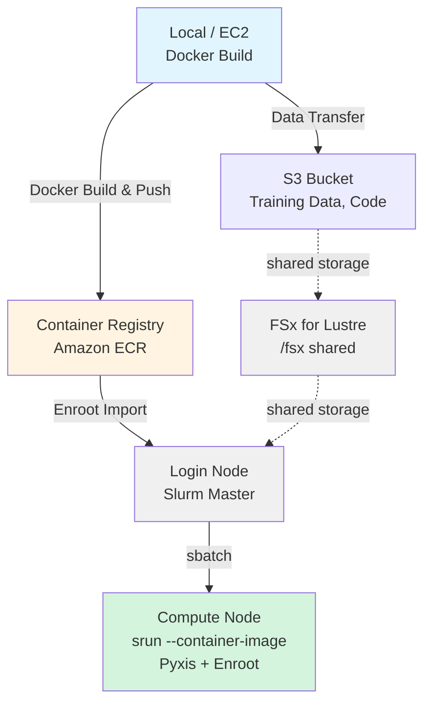

# HyperPod + Slurm + Enroot での OpenPI LoRA トレーニング実行ガイド

AWS SageMaker HyperPod 上で Slurm + Enroot を使用して Docker コンテナで LoRA ファインチューニングを実行するガイドです。

## アーキテクチャ



---

## 前提条件

### 必要な認証情報

1. **Hyperpod クラスタ**: 本プロジェクト内の CDK を使って Hyperpod クラスタを AWS 上に構築している
	1. 以下の手順では、CDK で構築されている Hyperpod を前提に記述しますが、コンソールなどから手動で作成した Hyperpod でも同様に学習実行は可能です。
2. **AWS 認証情報設定**: ECR アクセス用
3. **Hugging Face トークン**: データセットダウンロード用 (`HF_TOKEN`)

---

## 実行手順

### Phase 1: ローカル環境でのイメージビルド & ECR プッシュ

#### 1.1 Docker イメージのビルドと ECR への Push

```bash
cd samples/openpi-sample/

# openpi を Clone
git clone https://github.com/Physical-Intelligence/openpi.git

cd lora_training/

# ECR にビルド & プッシュ（AWS CLI のデフォルトリージョンを使用）
./build_and_push_ecr.sh

# リージョンとアカウントIDの両方を指定する場合 
./build_and_push_ecr.sh us-west-2 123456789012

# 特定のタグを指定する場合
IMAGE_TAG=v1.0.0 ./build_and_push_ecr.sh
```

**環境情報の取得方法（ローカルPC）**:

スクリプトは以下の優先順位で環境情報を取得します：

1. **コマンドライン引数**（最優先）
2. **環境変数** (`AWS_REGION`, `AWS_ACCOUNT_ID`)
3. **AWS CLI設定**
   - リージョン: `aws configure get region`
   - アカウントID: `aws sts get-caller-identity --query Account --output text`

**実行内容**:
- ECR リポジトリ `openpi-lora-train` の作成（存在しない場合）
- Docker イメージのビルド（`train_lora.Dockerfile` を使用）
- ECR へのプッシュ

**出力例**:
```
✅ Docker image successfully pushed to ECR
Image URI: 123456789012.dkr.ecr.us-west-2.amazonaws.com/openpi-lora-train:latest
```

---

### Phase 2: データ転送

- 以下のコマンドから処理ファイル一式を Hyperpod 構築 CDK で作成されている S3 バケットに転送します。
- S3 該当バケット内のデータは FSx Lutstre を経由して Hyperpod 内に自動で配置されます。
- また独自の学習データなどがある場合は、以下を参考に S3 にデータを転送してください。

```bash
cd samples/

zip -r openpi-sample.zip openpi-sample/

aws s3 cp ./openpi-sample.zip \
    s3://pask-bucketdata111111-XXXXXXXXXXXX/openpi-sample.zip
```

---

### Phase 3: HyperPod Controller Node での準備

#### 2.1 HyperPod への SSH 接続
[DEPLOYMENT.md](../../../hyperpod/docs/DEPLOYMENT.md) の 2.7.クラスタの初期設定を参考に HyperPod に SSH 接続

#### 2.2 プロジェクトのセットアップ

```bash
# コード一式を User Directory に移動
cp /fsx/s3link/openpi-sample.zip /fsx/ubuntu/

# unzip モジュールインストール
sudo apt install -y unzip

# コード一式を解凍
unzip openpi-sample.zip

# 実行権限追加
sudo chmod -R +x openpi-sample/

# セットアップを実行。パラメータについて以下を参照
cd openpi-sample/lora_training

./setup.sh --hf-token "hf_xxxxx"

source ~/.bashrc
```

**パラメータについて**
- hf-token(オプション）:  "hf_" から始まる Hugging Face のTokenを指定
	- [Hugging Face](https://huggingface.co/settings/tokens) での事前 Sing Up とToken の払い出しが必要です。

**実行内容について**
  1. OpenPI リポジトリのクローン
    - /fsx/ubuntu/openpi-sample/openpi/ が存在しない場合
    - GitHub から git clone https://github.com/Physical-Intelligence/openpi.git を実行
  2. ディレクトリ構造の作成
    - /fsx/ubuntu/openpi-sample/logs/
    - /fsx/ubuntu/openpi-sample/.cache/
    - /fsx/ubuntu/openpi-sample/openpi/assets/physical-intelligence/libero/
  3. 環境変数を ~/.bashrc に設定 🆕
    - 既存の OpenPI/Enroot 設定があれば削除（バックアップ作成）
    - 以下の環境変数を追記：**!重要**これらの環境変数は、すべての Slurm ジョブスクリプトで使用されます。
	    - export OPENPI_BASE_DIR=/fsx/ubuntu/openpi-sample
	    - export OPENPI_PROJECT_ROOT=${OPENPI_BASE_DIR}/openpi
	    - export OPENPI_DATA_HOME=${OPENPI_BASE_DIR}/.cache
	    - export OPENPI_LOG_DIR=${OPENPI_BASE_DIR}/logs
	    - export HF_TOKEN=<引数で指定した値 or 空>
	    - export ENROOT_CACHE_PATH=/fsx/enroot
	    - export ENROOT_DATA_PATH=/fsx/enroot/data

**Weights & Biases (wandb) について**:
- デフォルトのスクリプトでは wandb を無効化しています (`--no-wandb-enabled`)
- wandb でトレーニングをトラッキングしたい場合:
  1. [wandb.ai](https://wandb.ai) でアカウントを作成
  2. API key を取得して `~/.bashrc` に追加: `export WANDB_API_KEY=your_key_here`
  3. スクリプトから `--no-wandb-enabled` を削除（または `--wandb-enabled` に変更）

#### 2.4 Enroot で Docker イメージをインポート

```bash
# ECR イメージを Enroot 形式に変換
cd openpi-sample/lora_training

# EC2 メタデータから自動取得
./hyperpod_import_container.sh

# イメージタグを指定
./hyperpod_import_container.sh v1.0.0

# リージョンを指定
./hyperpod_import_container.sh latest us-west-2
```

**環境情報の取得方法（HyperPod Cluster）**:

スクリプトは以下の優先順位で環境情報を取得します。Hyperpod 内で特にコマンドライン引数や環境変数設定なしに実行した場合、EC2インスタンスメタデータから取得することになります。：

1. **コマンドライン引数**（最優先）
   ```bash
   ./hyperpod_import_container.sh [IMAGE_TAG] [AWS_REGION] [AWS_ACCOUNT_ID]
   ```

2. **環境変数**
   ```bash
   export AWS_REGION=us-west-2
   export AWS_ACCOUNT_ID=123456789012
   ./hyperpod_import_container.sh
   ```

3. **自動検出**
   - **リージョン**: EC2インスタンスメタデータ（IMDSv2）
     ```bash
     TOKEN=$(curl -X PUT "http://169.254.169.254/latest/api/token" \
       -H "X-aws-ec2-metadata-token-ttl-seconds: 21600" -s)
     curl -H "X-aws-ec2-metadata-token: $TOKEN" -s \
       http://169.254.169.254/latest/meta-data/placement/region
     ```

   - **アカウントID**: AWS STS
     ```bash
     aws sts get-caller-identity --query Account --output text
     ```

4. **フォールバック**: リージョンは `us-east-1`

**実行内容**:
- ECR から Docker イメージを Pull
- SquashFS 形式 (`.sqsh`) に変換
- `/fsx/enroot/data/` に保存

**出力例**:
```
✅ Container ready for Slurm execution
Container Name: openpi-lora-train+latest.sqsh
```

**確認**:
```bash
# インポートされたコンテナを確認
enroot list

# 出力例:
# openpi-lora-train+latest.sqsh
```

---

### Phase 3: Slurm ジョブの実行

#### 3.1 Step 1: 正規化統計の計算（初回のみ）

```bash
cd openpi-sample/lora_training

# Slurm ジョブとして投入
sbatch ./slurm_compute_norm_stats.sh pi0_libero_low_mem_finetune

# ジョブ ID が返される（例: Submitted batch job 1234）
```

**進捗確認**:
```bash
# ジョブ状態確認
squeue -u ubuntu

# リアルタイムログ監視
tail -f ${OPENPI_LOG_DIR}/slurm_<JOB_ID>.out

# エラーログ確認
tail -f ${OPENPI_LOG_DIR}/slurm_<JOB_ID>.err
```

**Hugging Face Quota エラーについて**:
サンプルの学習データを使用する場合、Hugging Face からのダウンロード時に以下のような Quota エラーが発生することがあります。
この場合は、少し時間をあけてから再度 `./slurm_compute_norm_stats.sh` を実行してください。
ダウンロードの途中から再開されるため、2回目では  Quota エラーなく処理が完了します。
```
huggingface_hub.errors.HfHubHTTPError: 429 Client Error: Too Many Requests for url: https://huggingface.co/api/datasets/physical-intelligence/
We had to rate limit you, you hit the quota of 1000 api requests per 5 minutes period. Upgrade to a PRO user or Team/Enterprise organization account (https://hf.co/pricing) to get higher limits. See https://huggingface.co/docs/hub/rate-limits
```

---

#### 3.2 Step 2: LoRA ファインチューニングの実行（GPU ジョブ）

```bash
# LoRA トレーニングを投入
sbatch ./slurm_train_lora.sh pi0_libero_low_mem_finetune my_lora_run

# カスタム実験名で実行
sbatch ./slurm_train_lora.sh pi0_libero_low_mem_finetune experiment_$(date +%Y%m%d)
```

**進捗確認**:
```bash
# ジョブ状態確認
squeue -u ubuntu

# GPU 使用状況（compute node で）
srun --jobid=<JOB_ID> nvidia-smi

# リアルタイムログ監視
tail -f ${OPENPI_LOG_DIR}/slurm_<JOB_ID>.out

# エラーログ確認
tail -f ${OPENPI_LOG_DIR}/slurm_<JOB_ID>.err
```

**トレーニング中の典型的なログ**:
```
[1000/30000] loss=0.234 lr=1e-4 step_time=1.2s
[2000/30000] loss=0.189 lr=9e-5 step_time=1.1s
Saving checkpoint to /fsx/ubuntu/openpi_test/openpi/checkpoints/pi0_libero_low_mem_finetune/my_lora_run/2000
```

**完了確認**:
```bash
# ジョブ完了状態
sacct -j <JOB_ID> --format=JobID,State,ExitCode

# チェックポイントの確認
ls -lh ${OPENPI_PROJECT_ROOT}/checkpoints/pi0_libero_low_mem_finetune/my_lora_run/

# 出力例:
# drwxr-xr-x  1000/
# drwxr-xr-x  2000/
# drwxr-xr-x  5000/
# drwxr-xr-x  30000/  ← 最終チェックポイント
```

---

## Slurm ジョブ管理コマンド

### ジョブの確認

```bash
# 自分のジョブ一覧
squeue -u ubuntu

# 詳細情報
squeue -u ubuntu -o "%.18i %.9P %.30j %.8u %.2t %.10M %.6D %R"

# すべてのジョブ（クラスター全体）
squeue
```

### ジョブのキャンセル

```bash
# 特定のジョブをキャンセル
scancel <JOB_ID>

# 自分のすべてのジョブをキャンセル
scancel -u ubuntu

# 特定の名前のジョブをキャンセル
scancel --name=openpi_lora_train
```


---


## 参考リソース

### ドキュメント
- [training_lora_finetune.md](training_lora_finetune.md) - LoRA ファインチューニング詳細
- [AWS HyperPod ドキュメント](https://docs.aws.amazon.com/sagemaker/latest/dg/sagemaker-hyperpod.html)
- [Enroot ドキュメント](https://github.com/NVIDIA/enroot)
- [Slurm ドキュメント](https://slurm.schedmd.com/documentation.html)
