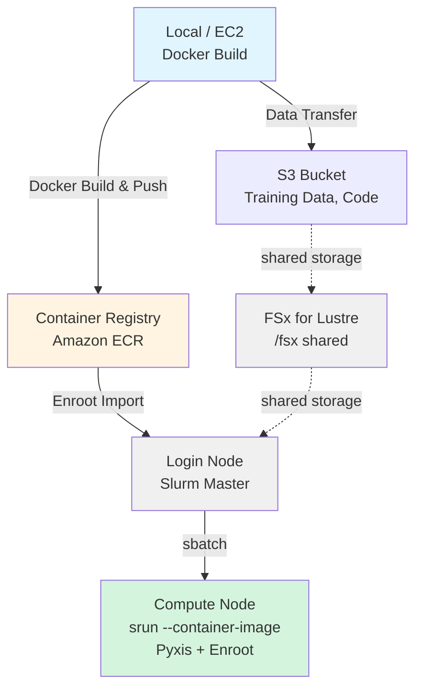

# HyperPod + Slurm + Enroot에서의 OpenPI LoRA 트레이닝 실행 가이드

AWS SageMaker HyperPod에서 Slurm + Enroot를 사용하여 Docker 컨테이너로 LoRA 파인튜닝을 실행하는 가이드입니다.

## 아키텍처



***

## 환경 준비

1. **HyperPod 클러스터**: 본 프로젝트 내의 CDK를 사용하여 HyperPod 클러스터를 AWS에 구축한 상태
	아래 절차에서는 CDK로 구축된 HyperPod를 전제로 설명하지만, 콘솔 등에서 수동으로 생성한 HyperPod에서도 동일하게 학습을 실행할 수 있습니다.
2. **개발 환경**: 다음 설정이 필요합니다.
	1. AWS 인증 정보 설정: ECR 접근용
	2. Docker: pi0 학습용 이미지 빌드용
3. **Hugging Face 토큰**: 샘플 학습 데이터셋 다운로드용 (`HF_TOKEN`)
	1. [Hugging Face](https://huggingface.co/settings/tokens)에서 사전 가입 및 토큰 발급이 필요합니다. 자체 학습 데이터를 사용하는 경우에는 불필요합니다.

***

## 실행 절차

### 로컬 환경에서의 이미지 빌드 & ECR 푸시

#### Docker 이미지 빌드 및 ECR Push

```bash
cd samples/openpi-sample/

# openpi를 Clone
git clone https://github.com/Physical-Intelligence/openpi.git

cd lora_training/

# ECR에 빌드 & 푸시 (AWS CLI의 기본 리전 사용)
./build_and_push_ecr.sh

# 리전과 계정 ID를 모두 지정하는 경우
./build_and_push_ecr.sh us-west-2 123456789012

# 특정 태그를 지정하는 경우
IMAGE_TAG=v1.0.0 ./build_and_push_ecr.sh
```

**환경 정보 확인 방법(로컬 PC)**:

스크립트는 다음 우선순위로 환경 정보를 가져옵니다:

1. **커맨드라인 인자**(최우선)
2. **환경 변수** (`AWS_REGION`, `AWS_ACCOUNT_ID`)
3. **AWS CLI 설정**
   * 리전: `aws configure get region`
   * 계정 ID: `aws sts get-caller-identity --query Account --output text`

**실행 내용**:
* ECR 리포지토리 `openpi-lora-train` 생성(존재하지 않는 경우)
* Docker 이미지 빌드(`train_lora.Dockerfile` 사용)
* ECR로 푸시

**출력 예시**:

```
✅ Docker image successfully pushed to ECR
Image URI: 123456789012.dkr.ecr.us-west-2.amazonaws.com/openpi-lora-train:latest
```

***

### HyperPod Login Node에서의 준비

#### HyperPod SSH 접속

[DEPLOYMENT.md](../../../hyperpod/docs/DEPLOYMENT.md)의 HyperPod SSH 접속 방법을 참고하여 접속합니다.
```
ssh pask-cluster
```

#### 프로젝트 설정

```bash
# PASK 리포지토리 clone
cd
git clone https://github.com/aws-samples/sample-physical-ai-scaffolding-kit.git

# 설정 실행. 파라미터는 아래 참조
cd samples/openpi-sample/lora_training
./setup.sh --hf-token "hf_xxxxx"

# 환경 변수 반영
source ~/.bashrc
```

**파라미터 안내**
* hf-token(선택): "hf\_"로 시작하는 Hugging Face 토큰을 지정
	* [Hugging Face](https://huggingface.co/settings/tokens)에서 사전 가입 및 토큰 발급이 필요합니다.

**실행 내용**

1. OpenPI 리포지토리 클론
	- /fsx/ubuntu/samples/openpi-sample/openpi/가 존재하지 않는 경우
	- GitHub에서 git clone <https://github.com/Physical-Intelligence/openpi.git> 실행
2. 디렉토리 구조 생성
	- /fsx/ubuntu/samples/openpi-sample/logs/
	- /fsx/ubuntu/samples/openpi-sample/.cache/
	- /fsx/ubuntu/samples/openpi-sample/openpi/assets/physical-intelligence/libero/
3. 환경 변수를 \~/.bashrc에 설정
	- 기존 OpenPI/Enroot 설정이 있으면 삭제(백업 생성)
	- 다음 환경 변수를 추가: 이 환경 변수들은 모든 Slurm 작업 스크립트에서 사용됩니다.
		* export OPENPI\_BASE\_DIR=/fsx/ubuntu/samples/openpi-sample
		* export OPENPI\_PROJECT\_ROOT=\${OPENPI\_BASE\_DIR}/openpi
		* export OPENPI\_DATA\_HOME=\${OPENPI\_BASE\_DIR}/.cache
		* export OPENPI\_LOG\_DIR=\${OPENPI\_BASE\_DIR}/logs
		* export HF\_TOKEN=<인자로 지정한 값 또는 빈 값>
		* export ENROOT\_CACHE\_PATH=/fsx/enroot
		* export ENROOT\_DATA\_PATH=/fsx/enroot/data

**Weights & Biases (wandb) 관련**:
* 기본 스크립트에서는 wandb를 비활성화합니다 (`--no-wandb-enabled`)
* wandb로 트레이닝을 추적하고 싶은 경우:
  1. [wandb.ai](https://wandb.ai)에서 계정을 생성
  2. API 키를 발급받아 `~/.bashrc`에 추가: `export WANDB_API_KEY=your_key_here`
  3. 스크립트에서 `--no-wandb-enabled`를 제거(또는 `--wandb-enabled`로 변경)

---
#### Enroot로 Docker 이미지 임포트

```bash
# ECR 이미지를 Enroot 형식으로 변환
cd samples/openpi-sample/lora_training

# EC2 메타데이터에서 자동 가져오기
./hyperpod_import_container.sh

# 이미지 태그 지정
./hyperpod_import_container.sh v1.0.0

# 리전 지정
./hyperpod_import_container.sh latest us-west-2
```

**환경 정보 확인 방법(HyperPod Cluster)**:

스크립트는 다음 우선순위로 환경 정보를 가져옵니다. HyperPod 내에서 특별히 커맨드라인 인자나 환경 변수 설정 없이 실행한 경우, EC2 인스턴스 메타데이터에서 가져옵니다:

1. **커맨드라인 인자**(최우선)

   ```bash
   ./hyperpod_import_container.sh [IMAGE_TAG] [AWS_REGION] [AWS_ACCOUNT_ID]
   ```

2. **환경 변수**

   ```bash
   export AWS_REGION=us-west-2
   export AWS_ACCOUNT_ID=123456789012
   ./hyperpod_import_container.sh
   ```

3. **자동 감지**

   * **리전**: EC2 인스턴스 메타데이터(IMDSv2)

     ```bash
     TOKEN=$(curl -X PUT "http://169.254.169.254/latest/api/token" \
       -H "X-aws-ec2-metadata-token-ttl-seconds: 21600" -s)
     curl -H "X-aws-ec2-metadata-token: $TOKEN" -s \
       http://169.254.169.254/latest/meta-data/placement/region
     ```

   * **계정 ID**: AWS STS

     ```bash
     aws sts get-caller-identity --query Account --output text
     ```

4. **폴백**: 리전은 `us-east-1`

**실행 내용**:
* ECR에서 Docker 이미지 Pull
* SquashFS 형식 (`.sqsh`)으로 변환
* `/fsx/enroot/data/`에 저장

**출력 예시**:

```
✅ Container ready for Slurm execution
Container Name: openpi-lora-train+latest.sqsh
```

**확인**:

```bash
# 임포트된 컨테이너 확인
enroot list

# 출력 예시:
# openpi-lora-train+latest.sqsh
```


***

### Slurm 작업 실행

#### 정규화 통계 계산(최초 1회만)

```bash
cd samples/openpi-sample/lora_training

# Slurm 작업으로 제출
sbatch ./slurm_compute_norm_stats.sh pi0_libero_low_mem_finetune

# 작업 ID가 반환됩니다 (예: Submitted batch job 1234)
```

**진행 상황 확인**:

```bash
# 작업 상태 확인
squeue -u ubuntu

# 실시간 로그 모니터링
tail -f ${OPENPI_LOG_DIR}/slurm_<JOB_ID>.out

# 에러 로그 확인
tail -f ${OPENPI_LOG_DIR}/slurm_<JOB_ID>.err
```


##### 실행 에러 관련
**Hugging Face Quota 에러**:
샘플 학습 데이터를 사용하는 경우, Hugging Face에서 다운로드 시 다음과 같은 Quota 에러가 발생할 수 있습니다.
이 경우 5분 이상 간격을 두고 다시 `./slurm_compute_norm_stats.sh`를 실행해 주세요.
다운로드 중간부터 재개되므로, 두 번째 실행에서는 Quota 에러 없이 처리가 완료됩니다.

```
huggingface_hub.errors.HfHubHTTPError: 429 Client Error: Too Many Requests for url: https://huggingface.co/api/datasets/physical-intelligence/
We had to rate limit you, you hit the quota of 1000 api requests per 5 minutes period. Upgrade to a PRO user or Team/Enterprise organization account (https://hf.co/pricing) to get higher limits. See https://huggingface.co/docs/hub/rate-limits
```


***

#### LoRA 파인튜닝 실행(GPU 작업)

```bash
cd samples/openpi-sample/lora_training

# LoRA 트레이닝 제출
sbatch ./slurm_train_lora.sh pi0_libero_low_mem_finetune my_lora_run

# 커스텀 실험 이름으로 실행
sbatch ./slurm_train_lora.sh pi0_libero_low_mem_finetune experiment_$(date +%Y%m%d)
```

**진행 상황 확인**:

```bash
# 작업 상태 확인
squeue -u ubuntu

# GPU 사용 현황(compute node에서)
srun --jobid=<JOB_ID> nvidia-smi

# 실시간 로그 모니터링
tail -f ${OPENPI_LOG_DIR}/train_<JOB_ID>.out

# 에러 로그 확인
tail -f ${OPENPI_LOG_DIR}/train_<JOB_ID>.err
```

**트레이닝 중 일반적인 로그**:

```
[1000/30000] loss=0.234 lr=1e-4 step_time=1.2s
[2000/30000] loss=0.189 lr=9e-5 step_time=1.1s
Saving checkpoint to /fsx/ubuntu/openpi_test/openpi/checkpoints/pi0_libero_low_mem_finetune/my_lora_run/2000
```

**완료 확인**:

```bash
# 작업 완료 상태
sacct -j <JOB_ID> --format=JobID,State,ExitCode

# 체크포인트 확인
ls -lh ${OPENPI_PROJECT_ROOT}/checkpoints/pi0_libero_low_mem_finetune/my_lora_run/

# 출력 예시:
# drwxr-xr-x  1000/
# drwxr-xr-x  2000/
# drwxr-xr-x  5000/
# drwxr-xr-x  30000/  ← 최종 체크포인트
```

***

## Slurm 작업 관리 명령어

### 작업 확인

```bash
# 내 작업 목록
squeue -u ubuntu

# 상세 정보
squeue -u ubuntu -o "%.18i %.9P %.30j %.8u %.2t %.10M %.6D %R"

# 모든 작업(클러스터 전체)
squeue
```

### 작업 취소

```bash
# 특정 작업 취소
scancel <JOB_ID>

# 내 모든 작업 취소
scancel -u ubuntu

# 특정 이름의 작업 취소
scancel --name=openpi_lora_train
```

***

## 참고 리소스

### 문서

* [AWS HyperPod 문서](https://docs.aws.amazon.com/sagemaker/latest/dg/sagemaker-hyperpod.html)
* [Enroot 문서](https://github.com/NVIDIA/enroot)
* [Slurm 문서](https://slurm.schedmd.com/documentation.html)
